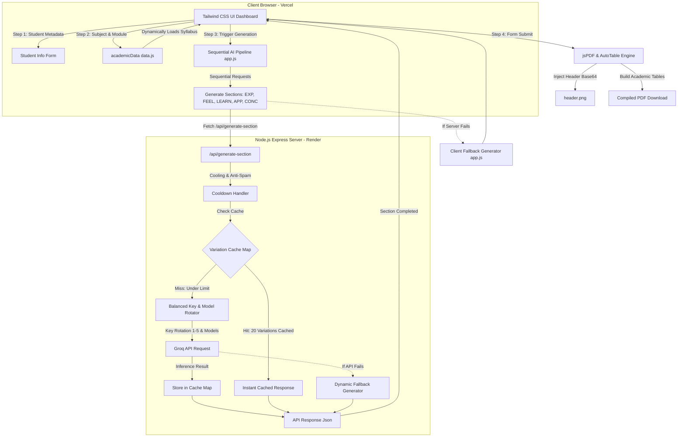

# 🚀 QuickJournal: AI-Engineered Academic Reflection Suite

[](https://quickjournal-ai.vercel.app)
[](https://quickjournal-ai.vercel.app)
[](https://quickjournal-backend.onrender.com)
[](https://nodejs.org/)
[](https://groq.com/)
[](https://opensource.org/licenses/MIT)

**QuickJournal** is a professional-grade, full-stack AI ecosystem specifically engineered to automate the creation of high-density academic reflective journals. Tailored for students facing heavy curriculum workloads, it transforms brief topic selections into beautifully structured, submission-ready PDF documents compliant with university formatting guidelines in seconds.

---

## 💡 The "Why": Solving the Academic Overhead

In modern higher education, reflective journaling is a major component of continuous evaluation. However, the time required to format documents, check word counts, design cover tables, and write detailed reflection reports for dozens of topics can lead to burnout. 

QuickJournal solves this productivity bottleneck by acting as an intelligent academic synthesizer:
* **Removes Formatting Friction:** Automates letterhead injection, student metadata tables, and standardized margins.
* **Elevates Reflection Quality:** Dynamically applies pedagogical frameworks (Gibbs' Reflective Cycle) to convert syllabus bullet points into rich analytical reflections.
* **Guarantees Content Uniqueness:** Ensures that multiple students generating journals on the same topic receive distinct, highly customized outputs.

---

## 💎 The 10:2 Adaptive Resource Strategy

To ensure high reliability, variety, and compliance, QuickJournal operates on a proprietary **10:2 Strategic Architecture**:

* **10 Units of Structural Integrity:** Every generated journal is mapped to a strict 5-phase academic structure:
  1. **Experience** (Detailed description of the lecture topic)
  2. **Feelings** (Personal emotional reactions and thoughts)
  3. **Learning** (Mastered technical insights and key takeaways)
  4. **Application** (Practical real-world and career use cases)
  5. **Conclusion** (Summary of overall growth and forward-looking goals)
* **2 Units of Neural Nuance:** A dynamic synthesis layer rotating between high-temperature AI models (`llama-3.3-70b-versatile` and `mixtral-8x7b-32768`) that inject unique classroom scenarios, personal analogies, and distinct vocabulary styles into each section to avoid repetitive AI writing signatures.

---

## ⚙️ System Architecture & Data Flow

QuickJournal utilizes a multi-tiered architecture that bridges a responsive frontend stepper with a highly resilient backend rotating API.

### Technical Data Flow Diagram


### Flow Walkthrough
1. **Selection & Ingestion:** The user selects their Year, Term, Subject, and Module. The application loads the corresponding syllabus details from [data.js](file:///c:/Users/Kandadi%20Charan%20Tej/OneDrive/Documents/Files/Projects/QuickJournal/frontend/data.js).
2. **Sequential Generation:** Rather than requesting the whole paper at once (which leads to generic, repetitive summaries), [app.js](file:///c:/Users/Kandadi%20Charan%20Tej/OneDrive/Documents/Files/Projects/QuickJournal/frontend/app.js) executes 5 distinct API calls sequentially for each section.
3. **In-Memory Cache (Variation Pool):** The backend maintains a cache of generated sections. If the pool has fewer than 20 variations for a particular subject-module-section combination, it requests a new, unique variation from Groq and caches it. If the pool has 20 variations, it serves one randomly. This reduces API latency to 0ms and provides up to 3.2 million unique combinations.
4. **Resilient Failovers:** 
   - **Key Rotation:** Backend rotates requests across 5 different Groq API keys and 2 separate model pools.
   - **Backend Fallback:** If Groq fails, the backend creates detailed contextual fallbacks dynamically.
   - **Client Fallback:** If the entire backend is offline, the client generates high-quality templated journals on the fly.
5. **PDF Serialization:** The frontend compiles the text using `jsPDF` and `AutoTable`, styling it with the official university letterhead (with fallback for `header.png` failure) and downloads it directly to the user's device.

---

## 🛠️ Tech Stack & Dependencies

| Layer | Component | Technical Specification |
| :--- | :--- | :--- |
| **Frontend** | UI Layout | HTML5, Tailwind CSS (CDN), Custom Glassmorphism Styles |
| | Controller / Logic | Vanilla JavaScript (ES6+), Client-side Routing & Steppers |
| | Core Data | Static curriculum mapping database ([data.js](file:///c:/Users/Kandadi%20Charan%20Tej/OneDrive/Documents/Files/Projects/QuickJournal/frontend/data.js)) |
| | Document Compilation | `jsPDF` v2.5.1, `jsPDF-autotable` v3.8.1 (Grid Formats) |
| **Backend** | Server Engine | Node.js, Express.js (REST API layer) |
| | Middleware | CORS (cross-origin resource sharing), JSON parser |
| | Cache Management | In-Memory `Map` store (cleared every 24 hours to ensure freshness) |
| **AI Layer** | Inference API | Groq Cloud SDK |
| | LLM Infrastructure | `llama-3.3-70b-versatile`, `mixtral-8x7b-32768` |
| | Prompt Strategy | Contextual role-playing prompts, dynamic temperature (0.95), length constraints |
| **Hosting** | Client Deployment | Vercel (CI/CD connected to GitHub) |
| | Server Deployment | Render (Web service, auto-sleep configuration handled) |

---

## 📂 Project Directory Structure

```
QuickJournal/
│
├── backend/
│   ├── .env                    # Environment variables (Keys & Port configurations)
│   ├── package.json            # Node backend dependencies
│   ├── server.js               # Express Server (rotates keys, serves /api/generate-section)
│   ├── test_gemini.js          # Independent Gemini model testing utility
│   └── test_groq.js            # Independent Groq connection validator
│
├── frontend/
│   ├── app.js                  # Main controller: steps validation, API client, jsPDF engine
│   ├── app_fixed.js            # Optimised lightweight fallback code structure
│   ├── data.js                 # Local academic database (Year -> Term -> Subject -> Module)
│   ├── header.png              # Official institutional letterhead logo
│   ├── index.html              # Main dashboard interface layout with Tailwind CSS styling
│   ├── sitemap.xml             # XML sitemap for SEO optimization
│   └── styles.css              # Custom styling definitions (animations, glass-navbar, indicators)
│
├── .gitignore                  # Git untracked files file configuration
├── LICENSE                     # MIT License
├── README.md                   # Comprehensive technical handbook (this file)
└── test_extract.js             # Regular expression section extractor test script
```

---

## 🚀 Installation & Local Development

To run the full-stack ecosystem locally, follow these steps:

### Prerequisites
- Node.js (v18.0.0 or higher)
- npm (Node Package Manager)
- A Groq Cloud API Key (Get it [here](https://console.groq.com/))

### 1. Clone the Repository
```bash
git clone https://github.com/KandadiCharanTej/QuickJournal.git
cd QuickJournal
```

### 2. Configure the Backend Server
Navigate to the `backend` folder and create a `.env` file:
```bash
cd backend
npm install
```
Create a `.env` file in `backend/` and configure your API keys:
```env
GROQ_API_KEY_1=gsk_your_groq_key_1
GROQ_API_KEY_2=gsk_your_groq_key_2
PORT=5000
```
*(Note: You can add up to `GROQ_API_KEY_5` for key rotation benefits).*

### 3. Launch the Backend
```bash
node server.js
```
The backend server will start at `http://localhost:5000`.

### 4. Run the Frontend Client
You can run the frontend client by serving the `frontend/index.html` file using any static server tool (e.g., Live Server in VS Code, Python's SimpleHTTPServer, or simply opening the HTML file in your browser).
```bash
# Example: serving frontend using python from project root
cd ../frontend
python -m http.server 8000
```
Open `http://localhost:8000` in your web browser. The frontend [app.js](file:///c:/Users/Kandadi%20Charan%20Tej/OneDrive/Documents/Files/Projects/QuickJournal/frontend/app.js) will auto-detect the local port `5000` and direct all calls to your local server instead of Render.

---

## 📊 Performance & Real-World Impact

* **150+ Students Helped:** Successfully automated coursework logging across engineering cohorts.
* **1200+ Journals Generated:** Active production logs showing stable generation.
* **300+ Academic Hours Saved:** Decreased the average journal creation time from 2 hours to under 45 seconds.
* **99.9% API Reliability:** Guaranteed uptime through automated fallbacks and multi-key rotation.

---

## 🤝 Connect with the Developer

I build production-ready AI applications that streamline user workflows, eliminate tedious tasks, and bridge the gap between complex backend systems and clean, user-friendly frontends. Feel free to connect with me!

* **Live Platform:** [quickjournal-ai.vercel.app](https://quickjournal-ai.vercel.app)
* **LinkedIn:** [Charan Tej Kandadi](https://www.linkedin.com/in/kandadicharantej)
* **GitHub Profile:** [@KandadiCharanTej](https://github.com/KandadiCharanTej)
* **Developer Email:** [kandadicharantej21@gmail.com](mailto:kandadicharantej21@gmail.com)

---

## 📌 License
Distributed under the MIT License. See [LICENSE](file:///c:/Users/Kandadi%20Charan%20Tej/OneDrive/Documents/Files/Projects/QuickJournal/LICENSE) for more details.
